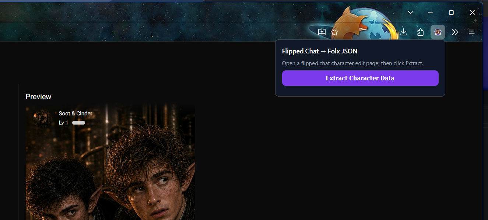
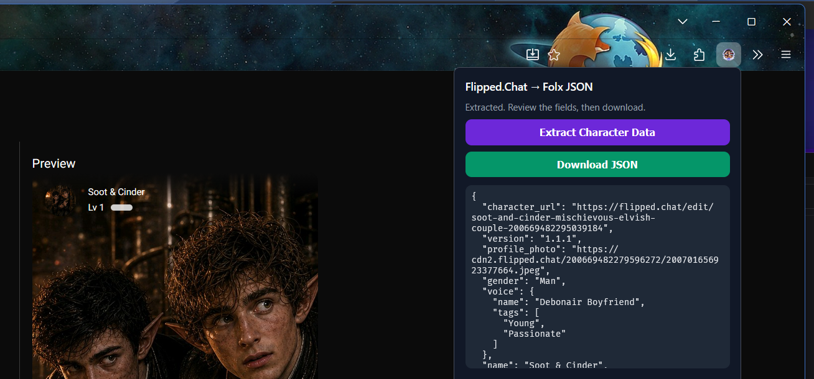

###### flipped-char-export-extension

# Flipped.Chat Character ⟶ JSON Exporter Browser Extension

In-context browser extension to export [Flipped.Chat](https://flipped.chat) characters to JSON for import into [Folx AI Contact Manager](assets/Folx-home.png), a database, or other app/service.

## What you need

1. A [zip or xpi file containing the browser extension](https://github.com/droidengineer/flipped-char-export-extension/releases) ⟶ unzipped somewhere
   
OR
2. Clone the GitHub repository

   ```git clone https://github.com/droidengineer/flipped-char-export-extension.git```

## Quick Start: Loading the browser extension
### Firefox
1. 🌐 Open Firefox ⇒ go to `about:debugging#/runtime/this-firefox`
2. Click **Load Temporary Add-on**
3. Select `manifest.json` inside the folder.

> [!IMPORTANT]
> Firefox temporary add-ons unload on browser restart — for a permanent installation, it must be signed via [Mozilla's add-on tools](https://addons.mozilla.org), but for personal use the temporary load is fine. If you need a permanent installation, please see me on Discord.


### Chrome
1. 🌐 Open Chrome ⇒ go to `chrome://extensions`
2. Enable **Developer mode** (top right)
3. Click **Load unpacked** then select the `flipped-char-export-extension` folder.

## ⮊ Exporting your Flipped.Chat Character

### To use it
1. Navigate to a `flipped.chat/edit/...` page while logged in
2. Click the extension icon
3. Hit **Extract Character Data**
4. Review the preview (and any ⚠ warnings), then **Download JSON**.

---

**How it works:**

1. You click the extension icon while on a `flipped.chat/edit/...` page (logged in).
2. It injects a script into that tab that reads the form fields directly from the DOM — including the actual `` for the profile photo.
3. A popup shows the extracted JSON and a Download button that saves it as a .json file.

⛔ ***Nothing ever gets changed or written back into your character. Your character data stays private.***


 Kid Tested. Mother Approved.
